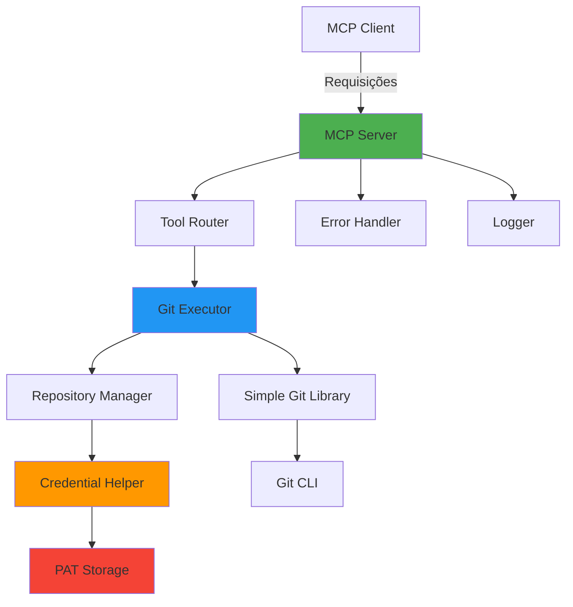
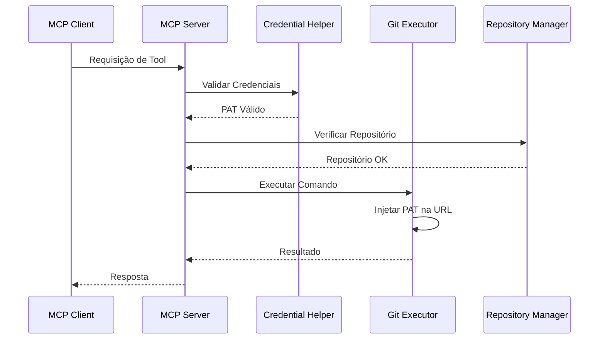
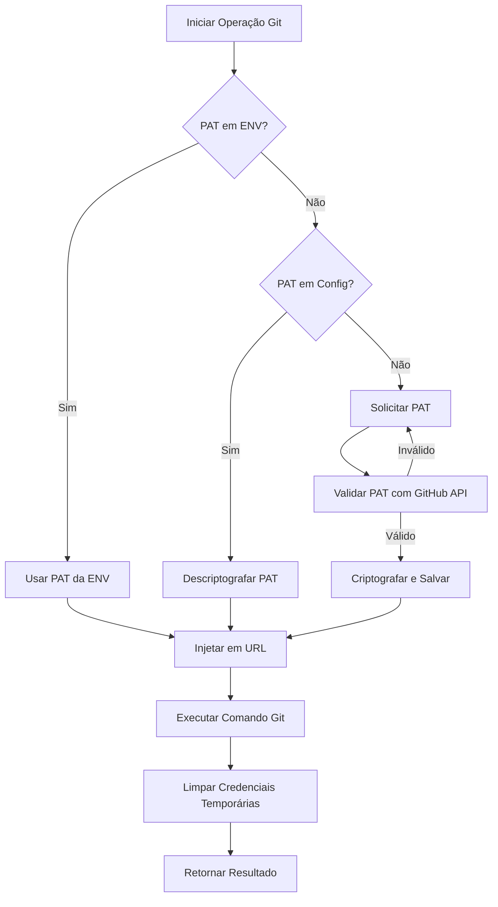

# Arquitetura do MCP Server para GitHub

## 📋 Sumário Executivo

Este documento detalha a arquitetura completa de um MCP (Model Context Protocol) Server para integração com GitHub, permitindo execução de comandos Git através de autenticação via Personal Access Token (PAT). O servidor suportará gerenciamento de múltiplos repositórios, operações Git básicas e avançadas, com foco em segurança e usabilidade.

---

## 🏗️ 1. Estrutura de Arquivos e Diretórios

```
mcp-github-server/
├── src/
│   ├── index.ts                 # Ponto de entrada do MCP server
│   ├── server.ts                # Configuração do servidor MCP
│   ├── config/
│   │   ├── config.ts            # Gerenciamento de configurações
│   │   └── auth.ts              # Gerenciamento de autenticação
│   ├── tools/
│   │   ├── index.ts             # Exportação de todas as tools
│   │   ├── clone.ts             # Tool: git_clone
│   │   ├── push.ts              # Tool: git_push
│   │   ├── pull.ts              # Tool: git_pull
│   │   ├── commit.ts            # Tool: git_commit
│   │   ├── status.ts            # Tool: git_status
│   │   ├── branch.ts            # Tool: git_branch
│   │   ├── checkout.ts          # Tool: git_checkout
│   │   ├── merge.ts             # Tool: git_merge
│   │   ├── rebase.ts            # Tool: git_rebase
│   │   ├── stash.ts             # Tool: git_stash
│   │   ├── remote.ts            # Tool: git_remote
│   │   ├── log.ts               # Tool: git_log
│   │   ├── diff.ts              # Tool: git_diff
│   │   └── tag.ts               # Tool: git_tag
│   ├── services/
│   │   ├── git-executor.ts      # Executor de comandos Git
│   │   ├── repository-manager.ts # Gerenciador de repositórios
│   │   └── credential-helper.ts  # Helper para credenciais
│   ├── utils/
│   │   ├── error-handler.ts     # Tratamento centralizado de erros
│   │   ├── logger.ts            # Sistema de logging
│   │   ├── validator.ts         # Validação de inputs
│   │   └── crypto.ts            # Funções de criptografia
│   └── types/
│       ├── index.ts             # Tipos TypeScript principais
│       ├── tools.ts             # Tipos das tools
│       └── git.ts               # Tipos relacionados ao Git
├── config/
│   ├── .env.example             # Exemplo de variáveis de ambiente
│   └── mcp-config.example.json  # Exemplo de configuração MCP
├── tests/
│   ├── unit/                    # Testes unitários
│   ├── integration/             # Testes de integração
│   └── fixtures/                # Dados de teste
├── docs/
│   ├── API.md                   # Documentação da API
│   ├── SETUP.md                 # Guia de instalação
│   └── SECURITY.md              # Práticas de segurança
├── .gitignore
├── package.json
├── tsconfig.json
├── README.md
└── LICENSE
```

---

## 🔧 2. Arquitetura Técnica

### 2.1 Stack Tecnológico

**Linguagem e Runtime:**
- **Node.js** (v18+): Runtime JavaScript
- **TypeScript** (v5+): Tipagem estática e melhor DX

**Dependências Principais:**
```json
{
  "dependencies": {
    "@modelcontextprotocol/sdk": "^1.0.0",
    "simple-git": "^3.20.0",
    "dotenv": "^16.3.1",
    "zod": "^3.22.4",
    "winston": "^3.11.0",
    "crypto-js": "^4.2.0"
  },
  "devDependencies": {
    "@types/node": "^20.0.0",
    "typescript": "^5.3.0",
    "tsx": "^4.7.0",
    "vitest": "^1.0.0"
  }
}
```

### 2.2 Componentes Principais



### 2.3 Fluxo de Dados



---

## 🛠️ 3. Especificação de Tools

### 3.1 Tools de Operações Básicas

#### **git_clone**
```typescript
{
  name: "git_clone",
  description: "Clona um repositório do GitHub para o sistema local",
  inputSchema: {
    type: "object",
    properties: {
      repository_url: {
        type: "string",
        description: "URL do repositório (HTTPS ou SSH)"
      },
      destination_path: {
        type: "string",
        description: "Caminho local de destino (opcional)"
      },
      branch: {
        type: "string",
        description: "Branch específica para clonar (opcional)"
      },
      depth: {
        type: "number",
        description: "Profundidade do clone (shallow clone, opcional)"
      }
    },
    required: ["repository_url"]
  }
}
```

#### **git_status**
```typescript
{
  name: "git_status",
  description: "Verifica o status atual do repositório",
  inputSchema: {
    type: "object",
    properties: {
      repository_path: {
        type: "string",
        description: "Caminho do repositório local"
      },
      verbose: {
        type: "boolean",
        description: "Mostrar informações detalhadas (opcional)"
      }
    },
    required: ["repository_path"]
  }
}
```

#### **git_commit**
```typescript
{
  name: "git_commit",
  description: "Cria um commit com as mudanças staged",
  inputSchema: {
    type: "object",
    properties: {
      repository_path: {
        type: "string",
        description: "Caminho do repositório local"
      },
      message: {
        type: "string",
        description: "Mensagem do commit"
      },
      files: {
        type: "array",
        items: { type: "string" },
        description: "Arquivos específicos para adicionar (opcional, default: todos)"
      },
      amend: {
        type: "boolean",
        description: "Emendar o último commit (opcional)"
      }
    },
    required: ["repository_path", "message"]
  }
}
```

#### **git_push**
```typescript
{
  name: "git_push",
  description: "Envia commits para o repositório remoto",
  inputSchema: {
    type: "object",
    properties: {
      repository_path: {
        type: "string",
        description: "Caminho do repositório local"
      },
      remote: {
        type: "string",
        description: "Nome do remote (default: origin)"
      },
      branch: {
        type: "string",
        description: "Branch para push (opcional, usa branch atual)"
      },
      force: {
        type: "boolean",
        description: "Force push (opcional, use com cuidado)"
      },
      set_upstream: {
        type: "boolean",
        description: "Configurar upstream tracking (opcional)"
      }
    },
    required: ["repository_path"]
  }
}
```

#### **git_pull**
```typescript
{
  name: "git_pull",
  description: "Busca e integra mudanças do repositório remoto",
  inputSchema: {
    type: "object",
    properties: {
      repository_path: {
        type: "string",
        description: "Caminho do repositório local"
      },
      remote: {
        type: "string",
        description: "Nome do remote (default: origin)"
      },
      branch: {
        type: "string",
        description: "Branch para pull (opcional, usa branch atual)"
      },
      rebase: {
        type: "boolean",
        description: "Usar rebase ao invés de merge (opcional)"
      }
    },
    required: ["repository_path"]
  }
}
```

### 3.2 Tools de Gerenciamento de Branches

#### **git_branch**
```typescript
{
  name: "git_branch",
  description: "Lista, cria ou deleta branches",
  inputSchema: {
    type: "object",
    properties: {
      repository_path: {
        type: "string",
        description: "Caminho do repositório local"
      },
      action: {
        type: "string",
        enum: ["list", "create", "delete", "rename"],
        description: "Ação a ser executada"
      },
      branch_name: {
        type: "string",
        description: "Nome da branch (para create/delete/rename)"
      },
      new_branch_name: {
        type: "string",
        description: "Novo nome da branch (para rename)"
      },
      force: {
        type: "boolean",
        description: "Forçar operação (opcional)"
      }
    },
    required: ["repository_path", "action"]
  }
}
```

#### **git_checkout**
```typescript
{
  name: "git_checkout",
  description: "Muda para outra branch ou restaura arquivos",
  inputSchema: {
    type: "object",
    properties: {
      repository_path: {
        type: "string",
        description: "Caminho do repositório local"
      },
      target: {
        type: "string",
        description: "Branch, commit ou tag de destino"
      },
      create_new: {
        type: "boolean",
        description: "Criar nova branch se não existir (opcional)"
      },
      files: {
        type: "array",
        items: { type: "string" },
        description: "Arquivos específicos para restaurar (opcional)"
      }
    },
    required: ["repository_path", "target"]
  }
}
```

### 3.3 Tools de Operações Avançadas

#### **git_merge**
```typescript
{
  name: "git_merge",
  description: "Mescla uma branch na branch atual",
  inputSchema: {
    type: "object",
    properties: {
      repository_path: {
        type: "string",
        description: "Caminho do repositório local"
      },
      source_branch: {
        type: "string",
        description: "Branch a ser mesclada"
      },
      strategy: {
        type: "string",
        enum: ["recursive", "ours", "theirs", "octopus"],
        description: "Estratégia de merge (opcional)"
      },
      no_ff: {
        type: "boolean",
        description: "Criar commit de merge mesmo em fast-forward (opcional)"
      },
      squash: {
        type: "boolean",
        description: "Squash commits antes do merge (opcional)"
      }
    },
    required: ["repository_path", "source_branch"]
  }
}
```

#### **git_rebase**
```typescript
{
  name: "git_rebase",
  description: "Reaplica commits em cima de outra base",
  inputSchema: {
    type: "object",
    properties: {
      repository_path: {
        type: "string",
        description: "Caminho do repositório local"
      },
      target_branch: {
        type: "string",
        description: "Branch base para rebase"
      },
      interactive: {
        type: "boolean",
        description: "Modo interativo (opcional)"
      },
      abort: {
        type: "boolean",
        description: "Abortar rebase em andamento (opcional)"
      },
      continue: {
        type: "boolean",
        description: "Continuar rebase após resolver conflitos (opcional)"
      }
    },
    required: ["repository_path"]
  }
}
```

#### **git_stash**
```typescript
{
  name: "git_stash",
  description: "Salva ou restaura mudanças temporariamente",
  inputSchema: {
    type: "object",
    properties: {
      repository_path: {
        type: "string",
        description: "Caminho do repositório local"
      },
      action: {
        type: "string",
        enum: ["save", "list", "apply", "pop", "drop", "clear"],
        description: "Ação a ser executada"
      },
      message: {
        type: "string",
        description: "Mensagem do stash (para save)"
      },
      stash_index: {
        type: "number",
        description: "Índice do stash (para apply/pop/drop)"
      },
      include_untracked: {
        type: "boolean",
        description: "Incluir arquivos não rastreados (opcional)"
      }
    },
    required: ["repository_path", "action"]
  }
}
```

### 3.4 Tools de Informação e Histórico

#### **git_log**
```typescript
{
  name: "git_log",
  description: "Exibe histórico de commits",
  inputSchema: {
    type: "object",
    properties: {
      repository_path: {
        type: "string",
        description: "Caminho do repositório local"
      },
      max_count: {
        type: "number",
        description: "Número máximo de commits (opcional, default: 10)"
      },
      branch: {
        type: "string",
        description: "Branch específica (opcional, usa branch atual)"
      },
      author: {
        type: "string",
        description: "Filtrar por autor (opcional)"
      },
      since: {
        type: "string",
        description: "Data inicial (formato ISO ou relativo, opcional)"
      },
      until: {
        type: "string",
        description: "Data final (formato ISO ou relativo, opcional)"
      },
      file_path: {
        type: "string",
        description: "Histórico de arquivo específico (opcional)"
      }
    },
    required: ["repository_path"]
  }
}
```

#### **git_diff**
```typescript
{
  name: "git_diff",
  description: "Mostra diferenças entre commits, branches ou working tree",
  inputSchema: {
    type: "object",
    properties: {
      repository_path: {
        type: "string",
        description: "Caminho do repositório local"
      },
      source: {
        type: "string",
        description: "Commit/branch de origem (opcional, usa working tree)"
      },
      target: {
        type: "string",
        description: "Commit/branch de destino (opcional)"
      },
      file_path: {
        type: "string",
        description: "Arquivo específico (opcional)"
      },
      staged: {
        type: "boolean",
        description: "Mostrar apenas mudanças staged (opcional)"
      }
    },
    required: ["repository_path"]
  }
}
```

### 3.5 Tools de Gerenciamento de Remotes

#### **git_remote**
```typescript
{
  name: "git_remote",
  description: "Gerencia repositórios remotos",
  inputSchema: {
    type: "object",
    properties: {
      repository_path: {
        type: "string",
        description: "Caminho do repositório local"
      },
      action: {
        type: "string",
        enum: ["list", "add", "remove", "rename", "set-url"],
        description: "Ação a ser executada"
      },
      remote_name: {
        type: "string",
        description: "Nome do remote"
      },
      remote_url: {
        type: "string",
        description: "URL do remote (para add/set-url)"
      },
      new_remote_name: {
        type: "string",
        description: "Novo nome do remote (para rename)"
      }
    },
    required: ["repository_path", "action"]
  }
}
```

#### **git_tag**
```typescript
{
  name: "git_tag",
  description: "Gerencia tags do repositório",
  inputSchema: {
    type: "object",
    properties: {
      repository_path: {
        type: "string",
        description: "Caminho do repositório local"
      },
      action: {
        type: "string",
        enum: ["list", "create", "delete", "push"],
        description: "Ação a ser executada"
      },
      tag_name: {
        type: "string",
        description: "Nome da tag"
      },
      message: {
        type: "string",
        description: "Mensagem da tag anotada (opcional)"
      },
      commit: {
        type: "string",
        description: "Commit específico para tag (opcional, usa HEAD)"
      }
    },
    required: ["repository_path", "action"]
  }
}
```

---

## 🔐 4. Fluxo de Autenticação e Gerenciamento do PAT

### 4.1 Estratégia de Armazenamento

**Prioridade de Busca:**
1. **Variável de Ambiente** (`GITHUB_PAT`)
2. **Arquivo de Configuração** (`~/.mcp-github/config.json`)
3. **Prompt Interativo** (fallback)

### 4.2 Estrutura do Arquivo de Configuração

```json
{
  "version": "1.0.0",
  "auth": {
    "github_pat": "encrypted_token_here",
    "encryption_key": "user_specific_key"
  },
  "repositories": {
    "default_path": "~/projects",
    "tracked": [
      {
        "name": "my-project",
        "path": "/path/to/repo",
        "remote": "origin"
      }
    ]
  },
  "preferences": {
    "auto_fetch": false,
    "default_branch": "main",
    "log_level": "info"
  }
}
```

### 4.3 Processo de Criptografia

```typescript
// Pseudo-código do processo de criptografia
class CredentialHelper {
  private encryptionKey: string;
  
  // Gera chave baseada em informações do sistema
  private generateEncryptionKey(): string {
    const machineId = os.hostname() + os.userInfo().username;
    return crypto.createHash('sha256').update(machineId).digest('hex');
  }
  
  // Criptografa o PAT
  encryptPAT(pat: string): string {
    const cipher = crypto.createCipher('aes-256-cbc', this.encryptionKey);
    return cipher.update(pat, 'utf8', 'hex') + cipher.final('hex');
  }
  
  // Descriptografa o PAT
  decryptPAT(encryptedPAT: string): string {
    const decipher = crypto.createDecipher('aes-256-cbc', this.encryptionKey);
    return decipher.update(encryptedPAT, 'hex', 'utf8') + decipher.final('utf8');
  }
}
```

### 4.4 Injeção de Credenciais em Operações Git

```typescript
class GitExecutor {
  // Injeta PAT na URL do repositório
  private injectCredentials(url: string, pat: string): string {
    // Converte: https://github.com/user/repo.git
    // Para: https://PAT@github.com/user/repo.git
    const urlObj = new URL(url);
    urlObj.username = pat;
    return urlObj.toString();
  }
  
  // Executa comando Git com credenciais
  async executeWithAuth(command: string, repoPath: string): Promise<string> {
    const pat = await this.credentialHelper.getPAT();
    const git = simpleGit(repoPath);
    
    // Configura credenciais temporariamente
    await git.addConfig('credential.helper', 'store');
    
    // Executa comando
    const result = await git.raw(command.split(' '));
    
    return result;
  }
}
```

### 4.5 Fluxo de Autenticação



---

## ⚠️ 5. Tratamento de Erros

### 5.1 Categorias de Erros

```typescript
enum GitErrorType {
  AUTHENTICATION_FAILED = 'AUTHENTICATION_FAILED',
  REPOSITORY_NOT_FOUND = 'REPOSITORY_NOT_FOUND',
  MERGE_CONFLICT = 'MERGE_CONFLICT',
  NETWORK_ERROR = 'NETWORK_ERROR',
  INVALID_REFERENCE = 'INVALID_REFERENCE',
  PERMISSION_DENIED = 'PERMISSION_DENIED',
  DIRTY_WORKING_TREE = 'DIRTY_WORKING_TREE',
  DETACHED_HEAD = 'DETACHED_HEAD',
  UNKNOWN_ERROR = 'UNKNOWN_ERROR'
}

interface GitError {
  type: GitErrorType;
  message: string;
  details?: string;
  suggestion?: string;
  recoverable: boolean;
}
```

### 5.2 Mapeamento de Erros Git

```typescript
class ErrorHandler {
  private errorPatterns = [
    {
      pattern: /Authentication failed|invalid credentials/i,
      type: GitErrorType.AUTHENTICATION_FAILED,
      suggestion: 'Verifique se o PAT está correto e tem as permissões necessárias'
    },
    {
      pattern: /Repository not found|could not read from remote/i,
      type: GitErrorType.REPOSITORY_NOT_FOUND,
      suggestion: 'Verifique se a URL do repositório está correta e se você tem acesso'
    },
    {
      pattern: /CONFLICT|Merge conflict/i,
      type: GitErrorType.MERGE_CONFLICT,
      suggestion: 'Resolva os conflitos manualmente e execute git add/commit'
    },
    {
      pattern: /network|connection|timeout/i,
      type: GitErrorType.NETWORK_ERROR,
      suggestion: 'Verifique sua conexão com a internet e tente novamente'
    },
    {
      pattern: /unknown revision|invalid reference/i,
      type: GitErrorType.INVALID_REFERENCE,
      suggestion: 'Verifique se a branch/commit/tag especificada existe'
    },
    {
      pattern: /Permission denied|insufficient permission/i,
      type: GitErrorType.PERMISSION_DENIED,
      suggestion: 'Verifique as permissões do PAT ou do sistema de arquivos'
    },
    {
      pattern: /working tree.*changes|uncommitted changes/i,
      type: GitErrorType.DIRTY_WORKING_TREE,
      suggestion: 'Faça commit ou stash das mudanças antes de continuar'
    }
  ];
  
  parseGitError(error: Error): GitError {
    const errorMessage = error.message;
    
    for (const pattern of this.errorPatterns) {
      if (pattern.pattern.test(errorMessage)) {
        return {
          type: pattern.type,
          message: errorMessage,
          suggestion: pattern.suggestion,
          recoverable: this.isRecoverable(pattern.type)
        };
      }
    }
    
    return {
      type: GitErrorType.UNKNOWN_ERROR,
      message: errorMessage,
      recoverable: false
    };
  }
  
  private isRecoverable(errorType: GitErrorType): boolean {
    const recoverableErrors = [
      GitErrorType.NETWORK_ERROR,
      GitErrorType.DIRTY_WORKING_TREE,
      GitErrorType.MERGE_CONFLICT
    ];
    return recoverableErrors.includes(errorType);
  }
}
```

### 5.3 Estratégias de Recuperação

```typescript
class RecoveryStrategy {
  async handleError(error: GitError, context: OperationContext): Promise<void> {
    switch (error.type) {
      case GitErrorType.MERGE_CONFLICT:
        return this.handleMergeConflict(context);
      
      case GitErrorType.DIRTY_WORKING_TREE:
        return this.handleDirtyWorkingTree(context);
      
      case GitErrorType.NETWORK_ERROR:
        return this.handleNetworkError(context);
      
      case GitErrorType.AUTHENTICATION_FAILED:
        return this.handleAuthenticationFailure(context);
      
      default:
        throw error;
    }
  }
  
  private async handleMergeConflict(context: OperationContext): Promise<void> {
    // Listar arquivos em conflito
    const conflicts = await this.git.status();
    
    // Retornar informações detalhadas sobre conflitos
    return {
      status: 'conflict',
      files: conflicts.conflicted,
      message: 'Conflitos detectados. Resolva manualmente e execute git_commit.'
    };
  }
  
  private async handleDirtyWorkingTree(context: OperationContext): Promise<void> {
    // Sugerir stash automático
    return {
      status: 'dirty',
      suggestion: 'Execute git_stash para salvar mudanças temporariamente'
    };
  }
  
  private async handleNetworkError(context: OperationContext): Promise<void> {
    // Implementar retry com backoff exponencial
    const maxRetries = 3;
    for (let i = 0; i < maxRetries; i++) {
      await this.sleep(Math.pow(2, i) * 1000);
      try {
        return await context.retryOperation();
      } catch (e) {
        if (i === maxRetries - 1) throw e;
      }
    }
  }
}
```

### 5.4 Logging de Erros

```typescript
class Logger {
  error(error: GitError, context: any): void {
    const logEntry = {
      timestamp: new Date().toISOString(),
      level: 'ERROR',
      type: error.type,
      message: error.message,
      context: {
        repository: context.repository_path,
        operation: context.operation,
        user: context.user
      },
      stack: error.details
    };
    
    // Log para arquivo
    this.writeToFile(logEntry);
    
    // Log para console (desenvolvimento)
    if (process.env.NODE_ENV === 'development') {
      console.error(JSON.stringify(logEntry, null, 2));
    }
  }
}
```

---

## ⚙️ 6. Configuração e Instalação

### 6.1 Instalação via NPM

```bash
# Instalação global
npm install -g mcp-github-server

# Ou instalação local no projeto
npm install mcp-github-server
```

### 6.2 Configuração Inicial

**Passo 1: Criar Personal Access Token no GitHub**
1. Acesse: https://github.com/settings/tokens
2. Clique em "Generate new token (classic)"
3. Selecione os escopos necessários:
   - `repo` (acesso completo a repositórios privados)
   - `workflow` (atualizar workflows do GitHub Actions)
   - `read:org` (ler dados da organização)
4. Copie o token gerado

**Passo 2: Configurar o MCP Server**

```bash
# Opção 1: Variável de ambiente
export GITHUB_PAT="ghp_your_token_here"

# Opção 2: Arquivo de configuração
mcp-github-server init
# Será solicitado o PAT e outras configurações
```

**Passo 3: Configurar no MCP Client (ex: Claude Desktop)**

Adicionar ao arquivo de configuração do MCP client:

```json
{
  "mcpServers": {
    "github": {
      "command": "node",
      "args": ["/path/to/mcp-github-server/dist/index.js"],
      "env": {
        "GITHUB_PAT": "ghp_your_token_here"
      }
    }
  }
}
```

### 6.3 Estrutura de Configuração Completa

**Arquivo: `~/.mcp-github/config.json`**

```json
{
  "version": "1.0.0",
  "auth": {
    "github_pat": "encrypted_token",
    "encryption_key": "auto_generated",
    "token_expiry": "2025-12-31T23:59:59Z"
  },
  "repositories": {
    "default_path": "~/projects",
    "tracked": [
      {
        "id": "repo-1",
        "name": "my-project",
        "path": "/Users/username/projects/my-project",
        "remote": "origin",
        "default_branch": "main",
        "auto_fetch": true
      }
    ]
  },
  "preferences": {
    "auto_fetch": false,
    "default_branch": "main",
    "log_level": "info",
    "max_log_entries": 1000,
    "retry_attempts": 3,
    "timeout": 30000
  },
  "security": {
    "allow_force_push": false,
    "require_confirmation": ["push --force", "branch -D", "reset --hard"],
    "blocked_operations": []
  }
}
```

### 6.4 Variáveis de Ambiente

```bash
# Autenticação
GITHUB_PAT=ghp_your_token_here

# Configuração
MCP_GITHUB_CONFIG_PATH=~/.mcp-github/config.json
MCP_GITHUB_LOG_LEVEL=info
MCP_GITHUB_LOG_PATH=~/.mcp-github/logs

# Comportamento
MCP_GITHUB_AUTO_FETCH=false
MCP_GITHUB_DEFAULT_BRANCH=main
MCP_GITHUB_TIMEOUT=30000

# Segurança
MCP_GITHUB_ALLOW_FORCE_PUSH=false
MCP_GITHUB_ENCRYPTION_ENABLED=true
```

### 6.5 Comandos CLI do MCP Server

```bash
# Inicializar configuração
mcp-github-server init

# Validar configuração
mcp-github-server validate

# Testar conexão com GitHub
mcp-github-server test-connection

# Listar repositórios rastreados
mcp-github-server list-repos

# Adicionar repositório ao tracking
mcp-github-server add-repo /path/to/repo

# Remover repositório do tracking
mcp-github-server remove-repo repo-id

# Atualizar PAT
mcp-github-server update-token

# Limpar cache e logs
mcp-github-server clean

# Exibir versão
mcp-github-server --version

# Exibir ajuda
mcp-github-server --help
```

---

## 🔒 7. Considerações de Segurança

### 7.1 Proteção do PAT

**Práticas Implementadas:**

1. **Criptografia em Repouso**
   - PAT armazenado sempre criptografado
   - Chave de criptografia derivada de informações do sistema
   - Nunca armazenar PAT em texto plano

2. **Criptografia em Trânsito**
   - Sempre usar HTTPS para comunicação com GitHub
   - Validar certificados SSL/TLS

3. **Gerenciamento de Memória**
   - Limpar PAT da memória após uso
   - Não logar PAT em arquivos de log
   - Usar variáveis temporárias com escopo limitado

4. **Permissões de Arquivo**
   ```bash
   # Configuração deve ter permissões restritas
   chmod 600 ~/.mcp-github/config.json
   ```

### 7.2 Validação de Inputs

```typescript
class InputValidator {
  validateRepositoryPath(path: string): boolean {
    // Prevenir path traversal
    const normalizedPath = path.normalize(path);
    if (normalizedPath.includes('..')) {
      throw new Error('Path traversal não permitido');
    }
    
    // Verificar se é um repositório Git válido
    return fs.existsSync(path.join(normalizedPath, '.git'));
  }
  
  validateBranchName(name: string): boolean {
    // Validar nome de branch segundo regras do Git
    const invalidChars = /[\s~^:?*\[\\]/;
    if (invalidChars.test(name)) {
      throw new Error('Nome de branch inválido');
    }
    return true;
  }
  
  validateCommitMessage(message: string): boolean {
    // Prevenir injection de comandos
    if (message.includes('`') || message.includes('$')) {
      throw new Error('Caracteres não permitidos na mensagem');
    }
    return true;
  }
}
```

### 7.3 Rate Limiting

```typescript
class RateLimiter {
  private requests: Map<string, number[]> = new Map();
  private readonly maxRequests = 100;
  private readonly timeWindow = 60000; // 1 minuto
  
  async checkLimit(operation: string): Promise<boolean> {
    const now = Date.now();
    const timestamps = this.requests.get(operation) || [];
    
    // Remover timestamps antigos
    const validTimestamps = timestamps.filter(t => now - t < this.timeWindow);
    
    if (validTimestamps.length >= this.maxRequests) {
      throw new Error('Rate limit excedido. Tente novamente em alguns segundos.');
    }
    
    validTimestamps.push(now);
    this.requests.set(operation, validTimestamps);
    
    return true;
  }
}
```

### 7.4 Auditoria

```typescript
class AuditLogger {
  logOperation(operation: AuditEntry): void {
    const entry = {
      timestamp: new Date().toISOString(),
      user: os.userInfo().username,
      operation: operation.type,
      repository: operation.repository,
      details: operation.details,
      success: operation.success,
      ip_address: this.getLocalIP()
    };
    
    // Salvar em arquivo de auditoria separado
    this.writeToAuditLog(entry);
  }
  
  private writeToAuditLog(entry: any): void {
    const logPath = path.join(os.homedir(), '.mcp-github', 'audit.log');
    fs.appendFileSync(logPath, JSON.stringify(entry) + '\n');
  }
}
```

---

## 📊 8. Monitoramento e Observabilidade

### 8.1 Métricas

```typescript
interface Metrics {
  operations: {
    total: number;
    successful: number;
    failed: number;
    by_type: Record<string, number>;
  };
  performance: {
    avg_response_time: number;
    p95_response_time: number;
    p99_response_time: number;
  };
  errors: {
    by_type: Record<GitErrorType, number>;
    last_24h: number;
  };
}
```

### 8.2 Health Check

```typescript
class HealthCheck {
  async check(): Promise<HealthStatus> {
    return {
      status: 'healthy',
      checks: {
        github_api: await this.checkGitHubAPI(),
        pat_valid: await this.checkPATValidity(),
        disk_space: await this.checkDiskSpace(),
        config_valid: await this.checkConfig()
      },
      timestamp: new Date().toISOString()
    };
  }
}
```

---

## 🧪 9. Testes

### 9.1 Estratégia de Testes

```typescript
// Testes Unitários
describe('GitExecutor', () => {
  it('deve injetar credenciais corretamente na URL', () => {
    const executor = new GitExecutor();
    const url = 'https://github.com/user/repo.git';
    const pat = 'ghp_token';
    const result = executor.injectCredentials(url, pat);
    expect(result).toBe('https://ghp_token@github.com/user/repo.git');
  });
});

// Testes de Integração
describe('git_clone tool', () => {
  it('deve clonar repositório público com sucesso', async () => {
    const result = await tools.git_clone({
      repository_url: 'https://github.com/octocat/Hello-World.git',
      destination_path: '/tmp/test-repo'
    });
    expect(result.success).toBe(true);
  });
});
```

---

## 📈 10. Roadmap de Implementação

### Fase 1: MVP (Semanas 1-2)
- [ ] Estrutura básica do projeto
- [ ] Implementação de git_clone, git_status, git_commit
- [ ] Sistema básico de autenticação com PAT
- [ ] Tratamento básico de erros

### Fase 2: Core Features (Semanas 3-4)
- [ ] Implementação de git_push, git_pull
- [ ] Gerenciamento de branches (git_branch, git_checkout)
- [ ] Sistema de criptografia para PAT
- [ ] Logging estruturado

### Fase 3: Advanced Features (Semanas 5-6)
- [ ] Operações avançadas (merge, rebase, stash)
- [ ] Gerenciamento de múltiplos repositórios
- [ ] Sistema de configuração completo
- [ ] Testes automatizados

### Fase 4: Polish & Release (Semana 7)
- [ ] Documentação completa
- [ ] Exemplos de uso
- [ ] CI/CD pipeline
- [ ] Publicação no NPM

---

## 🎯 11. Decisões Arquiteturais Principais

### 11.1 Por que Node.js/TypeScript?
- **Ecossistema MCP**: SDK oficial disponível
- **Async/Await**: Perfeito para operações I/O do Git
- **Type Safety**: TypeScript previne erros em runtime
- **Comunidade**: Amplo suporte e bibliotecas

### 11.2 Por que simple-git?
- **Abstração**: Interface JavaScript para Git CLI
- **Maturidade**: Biblioteca bem testada e mantida
- **Flexibilidade**: Suporta todos os comandos Git
- **Promessas**: API baseada em Promises

### 11.3 Estratégia de Autenticação
- **PAT vs OAuth**: PAT é mais simples para CLI tools
- **Criptografia Local**: Balanceia segurança e usabilidade
- **Fallback em ENV**: Facilita CI/CD e automação

### 11.4 Gerenciamento de Múltiplos Repositórios
- **Repository Manager**: Centraliza lógica de tracking
- **Configuração Persistente**: Mantém estado entre sessões
- **Isolamento**: Cada operação é independente

---

## 📚 12. Referências e Recursos

### Documentação Oficial
- [Model Context Protocol](https://modelcontextprotocol.io/)
- [GitHub REST API](https://docs.github.com/en/rest)
- [Git Documentation](https://git-scm.com/doc)
- [simple-git](https://github.com/steveukx/git-js)

### Segurança
- [OWASP Top 10](https://owasp.org/www-project-top-ten/)
- [GitHub Token Security](https://docs.github.com/en/authentication/keeping-your-account-and-data-secure/about-authentication-to-github)

### Boas Práticas
- [Conventional Commits](https://www.conventionalcommits.org/)
- [Semantic Versioning](https://semver.org/)
- [Git Flow](https://nvie.com/posts/a-successful-git-branching-model/)

---

## 📝 Notas Finais

Este documento serve como blueprint completo para implementação do MCP Server para GitHub. Todas as decisões arquiteturais foram tomadas considerando:

1. **Segurança**: Proteção do PAT e validação de inputs
2. **Usabilidade**: Interface clara e mensagens de erro úteis
3. **Extensibilidade**: Fácil adicionar novos comandos
4. **Manutenibilidade**: Código organizado e bem documentado
5. **Performance**: Operações eficientes e com retry logic

O próximo passo é iniciar a implementação seguindo o roadmap definido na Fase 1.